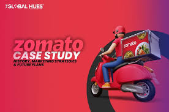

# 🍽️ Zomato Data Analysis: Unveiling Restaurant Trends and Consumer Preferences

## 📄 Project Overview

This project is a comprehensive analysis of Zomato’s restaurant data to identify key trends in customer preferences and restaurant performance. By answering critical business questions, this analysis provides actionable insights to help businesses grow strategically in the competitive food service industry.

## 🔍 Key Questions Explored

What type of restaurants do the majority of customers prefer?
How many votes has each type of restaurant received?
What are the ratings that each restaurant type has received?
What is the average amount spent by couples on food?
How does online ordering influence customer choices?

## 💡 Key Findings

1️⃣ Restaurant Preferences
Dining Restaurants: Primarily accept offline orders.
Cafes: Predominantly receive online orders.
Insight: Customers prefer in-person dining at restaurants and online orders for cafes.
2️⃣ Votes & Ratings
Cafes: Receive more votes and higher ratings through online orders, showcasing a stronger digital presence.
3️⃣ Spending Trends
Couples maintain a consistent average spending on meals, presenting opportunities for targeted promotions.

## 🚀 Tools & Techniques Used

Python: For data manipulation and analysis.
Pandas & NumPy: To clean and process the dataset efficiently.
Matplotlib & Seaborn: To visualize data and uncover patterns effectively.

## 🌟 Outcomes

Optimized Strategies: Provided actionable insights for restaurants to improve both offline and online operations.
Enhanced Customer Experience: Identified trends to help tailor services to customer preferences.
Skill Development: Strengthened expertise in data analysis, visualization, and deriving business insights.

## 📈 Visualizations

This analysis involved various types of visualizations, including:

Bar Charts: To explore restaurant types and their vote counts.
Heatmaps: To visualize correlations between variables.
Line Charts: To examine trends in spending patterns.

## ✨ Conclusion

This Zomato data analysis highlights a clear segmentation in customer preferences between dining restaurants and cafes. By leveraging these insights, businesses can:

Tailor their services to meet customer expectations.
Optimize marketing strategies for online and offline channels.
Enhance the overall customer experience, driving both revenue and loyalty.
